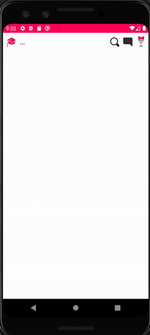

[](https://jitpack.io/#KonstantinosReppas/BottomCustomDialog)

# BottomCustomDialog
An iOS inspired bottom dialog with rounded corners




# Setup
Add this line in your root build.gradle at the end of repositories:

```gradle
allprojects {
  repositories {
    ...
    maven { url 'https://jitpack.io' } // this line
  }
}
  ```
Add this line in your app build.gradle:
```gradle
dependencies {
  implementation 'com.github.KonstantinosReppas:BottomCustomDialog:LATEST_VERSION'
}
```

# Usage
  1. Create a dialog class that extends BaseBottomDialog.
  
```
class MyCustomBottomDialog(
    c: Activity,
    backgroundTintColorId: Int //optional, default is white
) : BaseBottomDialog(c, backgroundTintColorId) {

    override fun onCreate(savedInstanceState: Bundle?) {
        super.onCreate(savedInstanceState)

        setContentView(R.layout.dialog_layout)
    }
}
```
  2. Use the new dialog.
  
```
  MyCustomBottomDialog(this).show()
```  
